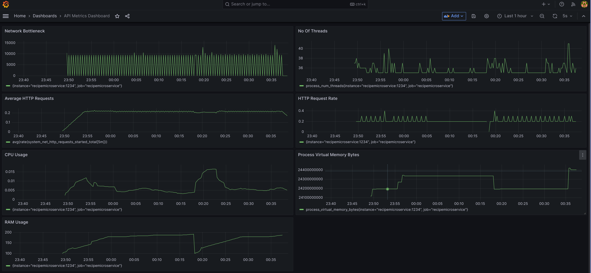

# Food Planner


This is a Recipe and Food Planner application built using .NET 6 and Docker. The application is structured as a collection of microservices and helps users manage recipes, meal plans, home inventory, and shopping lists based on nutrient information.


## Features

- [ ] Create, view, update, and delete recipes with detailed instructions and nutritional information.
- [ ] Create, view, update, and delete foods with nutritional information.
- [ ] Create, view, update, and delete meal plans containing recipes.
- [ ] Manage inventory at home, including food items and their quantities.
- [ ] Create, view, update, and delete shopping lists with food items and their locations.
- [ ] Monitor nutritional information for recipes, foods, and meal plans.
- [ ] Monitor food item quantities in inventory and shopping lists.
- [ ] Generate shopping lists based on meal plans and inventory.
- [ ] Generate meal plans based on inventory and shopping lists.
- [ ] Generate meal plans based on nutritional goals.
- [ ] Generate shopping lists based on nutritional goals.
- [ ] Generate meal plans based on food preferences.
- [ ] Generate shopping lists based on food preferences.
- [ ] Generate meal plans based on food allergies.
- [ ] Generate shopping lists based on food allergies.

- Monitoring Microservices
  - [ ] Logging
  - [ ] Health Checks
  - [ ] Metrics
  - [ ] Tracing


## Prerequisites

- [.NET 6 SDK](https://dotnet.microsoft.com/download/dotnet/6.0)
- [Visual Studio 2022](https://visualstudio.microsoft.com/vs/) (optional, but recommended)
- A running instance of MongoDB. Update the `RecipeFoodPlanner.Server/appsettings.json` file with your MongoDB connection settings.

## Getting Started

1. Clone this repository:

```bash
https://github.com/antoinebou12/FoodPlannerAPI
cd src
docker-compose up --build -d
# The application will be available at http://localhost:5000. You can browse the recipes, foods, meal plans, inventory, and shopping lists using the navigation menu.
```

2. Open the `RecipeFoodPlanner.sln` solution file in Visual Studio 2022 or your preferred IDE.

3. Set the `RecipeFoodPlanner.Server` project as the startup project.

4. Run the server-side application using the "Start" button in Visual Studio or by running the following command in the terminal:

```bash
dotnet run --project RecipeFoodPlanner.Server
```

5. Open a new terminal and navigate to the `RecipeFoodPlanner.Client` project directory. Start the client-side Blazor WebAssembly application using the following command:

```bash
dotnet run
```

6. The application will be available at http://localhost:5000. You can browse the recipes, foods, meal plans, inventory, and shopping lists using the navigation menu.

## API Documentation

The API documentation is available at http://localhost:5000/swagger/index.html.

## Testing

The unit tests for each microservice are located in the `Tests` directory. You can run the tests using the following command:

```bash
dotnet test
```

## Project Structure

- `RecipeMicroservice`: This microservice handles the creation, retrieval, updating, and deletion of recipes.
- `FoodMicroservice`: This microservice is responsible for managing foods and their nutritional information.
- `MealPlanMicroservice`: This service manages meal plans containing recipes.
- `InventoryMicroservice`: This microservice takes care of managing the inventory at home, including food items and their quantities.
- `ShoppingListMicroservice`: This service is responsible for managing shopping lists with food items and their locations.
- `APIGateway`: This is the entry point for all client requests. It forwards requests to appropriate microservices.
- `Tests`: Contains unit tests for each microservice.


## Services and Port Setup
Here's a brief overview of the services and their port configurations:

- recipemicroservice: The main application. Exposed on ports 5000 (HTTP), 5001 (HTTPS), 1234, and 4317.
- db: MySQL database service. No ports are exposed to the host machine, but it is accessible to other services on the default MySQL port (3306).
- redis: Redis service. Exposed on port 6379.
- prometheus: Monitoring service. Exposed on port 9090.
- grafana: Dashboard statistics service. Exposed on port 3000.
- jaeger: Distributed tracing service. Exposed on multiple ports including 16686, 6831, 6832, 5778, 4317, 4318, 14250, 14268, 14269, and 9411.
- zookeeper: Zookeeper service. Exposed on port 2181.
- kafka: Kafka service. Exposed on port 9092.

[

## Monitoring and Statistics

This application employs Application Insights for robust monitoring, complemented by Prometheus and Grafana for insightful dashboard statistics. Each microservice comes with built-in health checks, and Docker stats are available for comprehensive resource usage monitoring.

### Metrics Overview

A variety of metrics are collected to provide a comprehensive view of the system's performance and health:

- **prometheus_net_eventcounteradapter_sources_connected_total**: Represents the total number of event sources currently connected to the adapter.

- **microsoft_aspnetcore_hosting_requests_per_second_total**: Measures the total rate of requests per second coming into the ASP.NET Core application.

- **system_runtime_gc_fragmentation**: Indicates the percentage of fragmentation in the .NET runtime's Garbage Collector (GC).

- **system_net_security_tls12_sessions_open**: The count of active TLS 1.2 sessions.

- **system_runtime_threadpool_completed_items_count_total**: The total number of work items completed by the thread pool.

- **system_net_security_total_tls_handshakes**: The total count of completed TLS handshakes.

- **process_virtual_memory_bytes**: The total virtual memory used by the process, represented in bytes.

- **system_net_sockets_outgoing_connections_established**: The total number of outgoing connections established by sockets.

- **system_net_http_requests_started_total**: The total number of HTTP requests initiated.

- **dotnet_total_memory_bytes**: The total known allocated memory of your .NET application.

- **system_runtime_methods_jitted_count**: The count of methods that have been JIT compiled.

- **system_net_sockets_bytes_received**: The total number of bytes received by sockets.




## Contributing

Please feel free to submit issues, fork the repository and send pull requests!

## License

This project is licensed under the MIT License.
